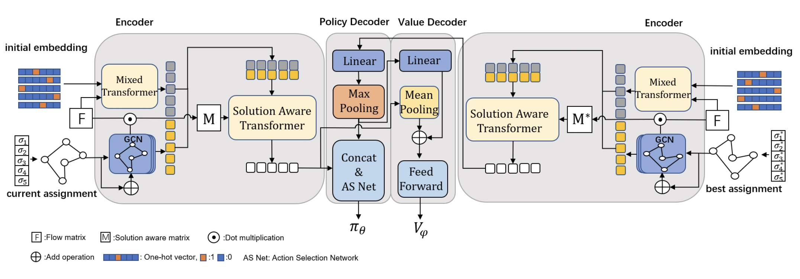

# SAWT
The official python implementation for ICML 2024: "[Learning Solution-Aware Transformers for Efficiently Solving Quadratic Assignment Problem](https://openreview.net/pdf?id=bBkQ51PmjC)" 


<p align="center">SAWT pipline</p>
## Environment

Our SAWT uses PyTorch 1.8.1 cuda version of 11.1, This can be installed by:

```python
pip install torch==1.8.0+cu111 torchvision==0.9.0+cu111 torchaudio==0.8.0 -f https://download.pytorch.org/whl/torch_stable.html
```

The minimum hardware requirement for our SAWT is a 3080 Ti. For training QAP50 and QAP100, using an A40 with 40GB of GPU memory is recommended.

## Dataset
The data for training and testing can be directly generated by (for example QAP20):

```python
python QAP_DataGenerator.py --N 20 --p 0.7 --train_size 5120 --test_size 256
```

The data will be stored in file /synthetic_data. The data for QAP50 and QAP100 can be downloaded using [Google Drive](https://drive.google.com/drive/folders/1mvhWWvhyBCsZLUTLWz7dacclAxnOa05P?usp=drive_link)

## Train
To train QAP20 for example:

```python
python QAP.py --name QAP20 --n_points 20 --train_size 5120 --batch_size 512 --test_size 256 --train_data ./synthetic_data/erdos20_0.7_F_train.npy ./synthetic_data/erdos20_0.7_positions_train.npy --test_data ./synthetic_data/erdos20_0.7_F_test.npy ./synthetic_data/erdos20_0.7_positions_test.npy --sat_layers 2
```

## Test
We release our trained model in /models, to test our SAWT, you can run the below code:

```python
python TestLearnedAgent_qap_init_emb.py --n_points 20 --load_path models/pg-QAP20.pt
```
This should give the results:
```
Initial Cost: 69.64822 Best Cost: 54.95407 Opt Cost: 55.29000 Gap: -0.54 % Time: 38.413771867752075
```
